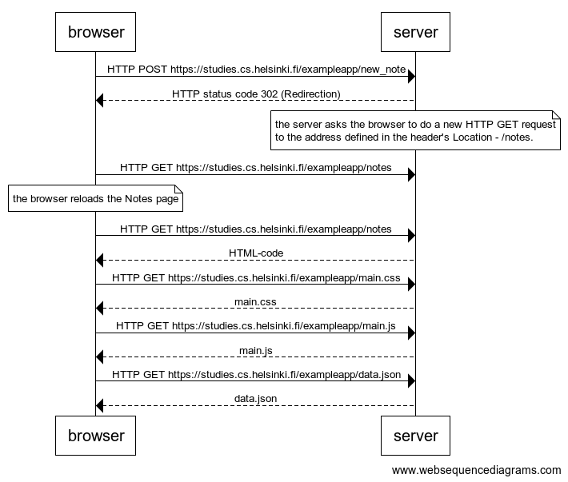
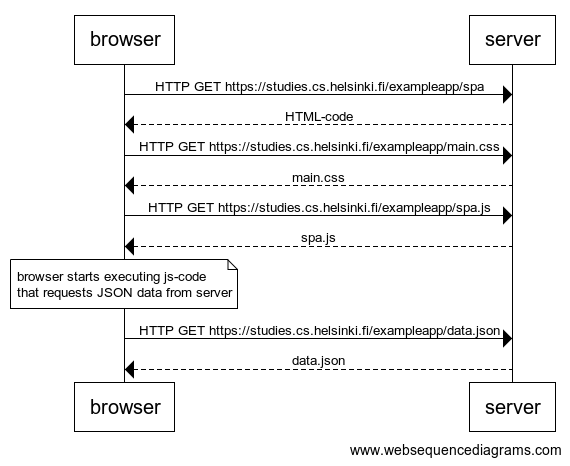
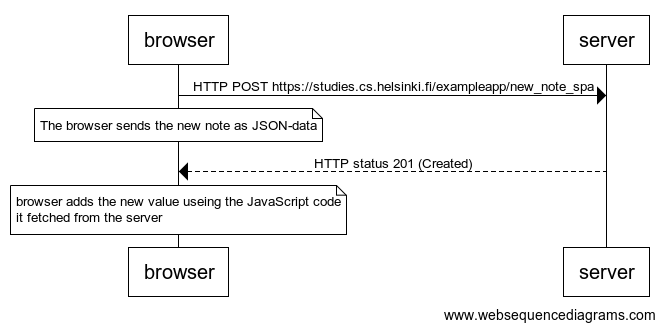

# Part 0 Fundemantal of Web apps

The diagram was made using [websequencediagrams](https://www.websequencediagrams.com/) service.

## 04: new note
depicting the situation where the user creates a new note on page https://studies.cs.helsinki.fi/exampleapp/notes by writing something into the text field and clicking the submit button.

## 0.5: Single page app

Create a diagram depicting the situation where the user goes to the single page app version of the notes app at https://studies.cs.helsinki.fi/exampleapp/spa.

## 06

Create a diagram depicting the situation where the user creates a new note using the single page version of the app.

